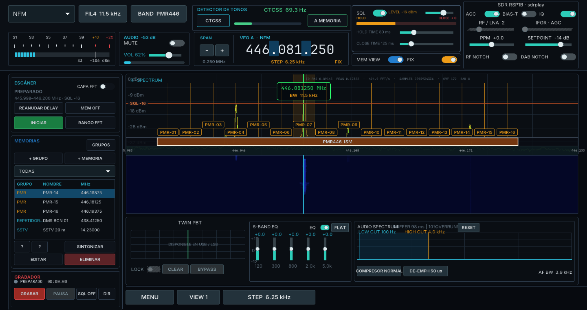
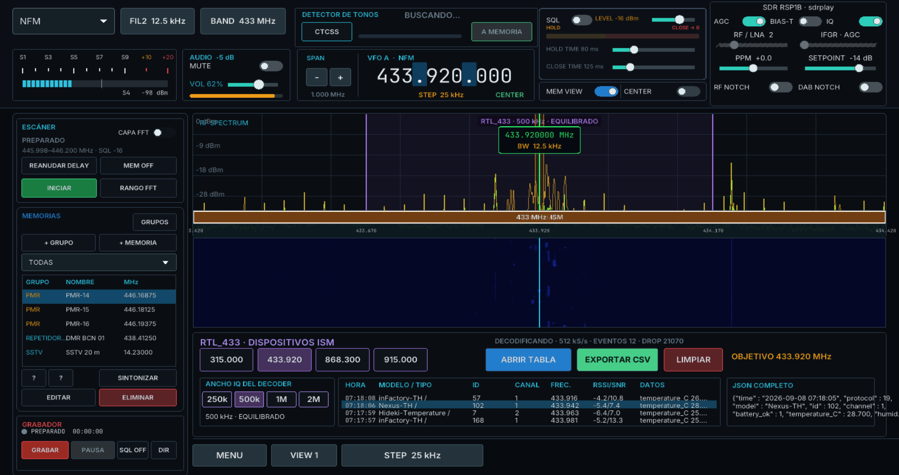

# IC-SDR

**Multi-mode SDR for Windows, written in Go for maximum efficiency.**

**Current version: [v0.3.1](https://github.com/LuislopezMartinez/IC-SDR/releases/tag/v0.3.1)**

*English translation of [README.md](README.md). The Spanish original remains
the reference document.*

IC-SDR brings reception, demodulation, spectrum analysis and digital signal
decoding together in a desktop interface designed for everyday use.

> [!IMPORTANT]
> IC-SDR is built specifically for **Windows**. The binary and everything else
> the portable distribution needs are in the `dist/IC-SDR-Go` folder once the
> package has been generated.



## Features

- Demodulation in **AM, NFM, WFM, LSB and USB**.
- Support for digital modes.
- Real-time spectrum and waterfall.
- Memory bank organised into groups.
- Audio recorder that skips silence automatically.
- Frequency segment scanner with instant trigger.
- Tone detector and squelch control.
- Five-band equaliser and audio processing controls.
- Interface in Spanish or English, switchable from the settings strip.

## Decoders

IC-SDR includes tools to receive and display:

- **AIS** — vessel tracking on the marine channels.
- **ADS-B** — aircraft reception on 1090 MHz and UAT 978 MHz.
- **Radiosondes** — support for RS41, DFM and M10/M20.
- **APRS** — packet reception and display.
- **RTL_433** — ISM sensor and device decoding, with CSV export.
- **DMR** — digital radio reception.
- **SSTV** — slow-scan television.
- **TETRA** — TETRA signal reception and analysis.



## Language

The interface ships in Spanish and British English. On first run IC-SDR picks
the language from the Windows locale: Spanish on a Spanish-language system,
English on any other. The two flags in the settings strip along the bottom of
the window switch language at any time, and the choice is saved to
`DATA/config/settings.json`.

Number formatting follows the language. The VFO dial groups its digits with
full stops in Spanish (`446.193.750`) and with commas in British English
(`446,193,750`); the digits themselves, and the decade each one tunes when you
click it, are unchanged.

## What's new in v0.3.1

- New satellite tracking module with a TLE catalogue updated from CelesTrak.
- World map showing position, orbit, visibility and satellite details.
- Search, grouping and tuning of the frequencies associated with each satellite.
- Audio recording in **MP3 or WAV**, selectable from the interface.
- Reworked recorder with level meter, history, playback and file deletion.
- Improved automatic silence skipping through the squelch.
- Visual and usability adjustments to memories, scanner and the tool menu.
- New tests for satellites, recording and memory markers.

## What's new in v0.2.1

- New visual themes, with better contrast and legibility throughout.
- Extended memory management with descriptions, priorities, colours and group
  editing.
- New presets for the aeronautical, marine and ISS/ARISS bands.
- Improvements to automatic SSTV mode and candidate mode selection.
- Redesign and usability work on the audio, scanner, recorder and utility
  panels.
- New tests for themes, contrast, memories and SSTV.

## Windows and the portable distribution

IC-SDR is meant to run on Windows. The local `dist/IC-SDR-Go` folder holds the
distributable `IC-SDR-Go.exe` binary, its runtimes and the supporting tools it
needs. The `DATA` directory must stay beside the executable.

The `dist/` folder is generated locally and is not part of the versioned source.
Rebuild it with `build-release.ps1`.

## Requirements

- Windows.
- Go 1.27 or later to build from source.
- An RTL-SDR or SoapySDR/SDRplay compatible receiver.

## Building

From the repository root:

```powershell
go build .
```

To generate the portable Windows distribution:

```powershell
powershell -ExecutionPolicy Bypass -File .\build-release.ps1
```

The distribution is created in `dist/IC-SDR-Go`. See
[DISTRIBUTION.en.md](DISTRIBUTION.en.md) for more about the portable package
and its data directories.

## Checking the interface after a translation

Because the interface is laid out in fixed pixel coordinates, a label that gets
longer when translated has nowhere to go. `cmd/uifit` measures every interface
string, in every language, against the control that draws it:

```powershell
go run .\cmd\uifit
```

It exits non-zero if anything overflows. Run it after adding an interface
string or editing the translation catalogue in `internal/i18n`.

## Continuous integration

`.github/workflows/ci.yml` runs on every push and pull request:

| Job | Runner | What it does |
| --- | --- | --- |
| Build and test | `windows-latest` | `go build ./...` and `go test ./...`. Windows is the only platform that can build the whole module, because `internal/sdr` and `internal/tetra` hold the SoapySDR and voice-codec bindings. |
| Formatting and interface fit | `ubuntu-latest` | `gofmt -l .` and `cmd/uifit`. Both only parse the source, so they cover the Windows-only packages too. `uifit` measures real font metrics, so it runs under Xvfb with Mesa's software renderer. |

`gofmt` runs on Linux rather than Windows deliberately: it compares bytes, so a
checkout that translated line endings would report every file as unformatted.

## Data and configuration

Settings, memories, recordings, captures, exports and logs are all stored under
`DATA`. Data produced while using the program is not committed to the
repository.

## Project status

IC-SDR is under active development. The features available depend on the
receiver, the drivers and the decoding tools installed.
